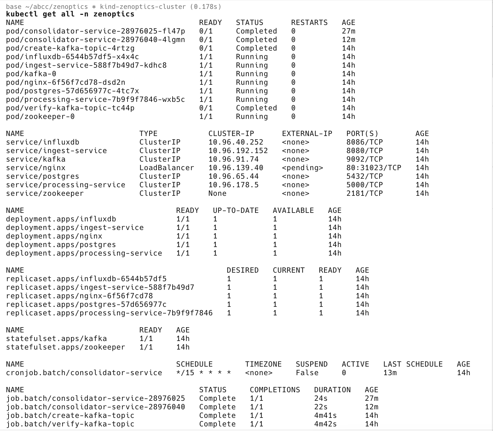

# Page Stats Dashboard

This README provides an overview of the Page Stats Dashboard, which is designed to create a dashboard for page visit statistics for an admin.

## System Design

### Design Considerations
- ~Million Users
- ~10 pages website
- ~10 visits per user
- 1M * 10 * 10 ~ 100 Million events per day (Kafka to capture these events)
- Admin Dashboard to show page stats region and timestamp wise (Relationl DB like Postgres to store dashboard data for region and daily, weekly, monthly aggregations)
- Processing of events and storage (Need an intermediary step to process and store the events in a DB like timeseries database. InfluxDB can be used here. As data is stored in timeseries DB, fetching them for a time duration say 1w, 1m, etc. is faster. To process huge amount of events and aggregate them as daily, weekly, monthly by computing for a date, Spark jobs can be used.)

## Flow Overview

### UI Step [ui](ui)
- **Tracker.js** script on the webpage sends events when a page is visited.
- Event format: `(timestamp, region, pageName)`.
- **Dashboard.js** in the UI fetches and displays page stats.
- Fetches data from `/aggregated-data/region-weekly?region=&startTime=&endTime=` in the ingest-service API.

### API Step [ingest-service](ingest-service)
- Events are handled by **ingest-service** via the `/page-view` API.
- Events are published to Kafka topics `page_view_events`.

### InfluxDB Step [processing-service](processing-service)
- **processing-service** continuously consumes Kafka topics.
- Data is stored in a time-series database, InfluxDB, in the `page_view_bucket`.

### Spark Jobs Step [consolidator-service](consolidator-service)
- **consolidator-service** runs as a cron job (daily, monthly, weekly, etc.).
- Processes time-series data and runs aggregation on data from InfluxDB.
- Aggregated data is stored in various Postgres database tables: `region_daily`, `region_weekly`, `region_monthly`.

### Nginx Step [nginx.conf](ui/nginx.conf)
- **nginx** is used for proxy and routing requests to the API.

## Kubernetes Deployment [kind-zenoptics-app.yaml](kind-zenoptics-app.yaml)
- **Deployment Apps**: InfluxDB, Postgres, ingest-service, processing-service.
- **StatefulSet Apps**: Kafka, Zookeeper.
- **CronJob Batch**: consolidator-service.
- **Service LoadBalancer**: nginx.
